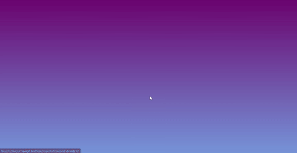

# Frontend Development Practice Projects

Welcome to my collection of frontend development practice projects. This repository contains various web development projects that demonstrate different frontend techniques using HTML, CSS, and JavaScript.

## Table of Contents

1. [Introduction](#introduction)
2. [Projects](#projects)
3. [How to View](#how-to-view)
4. [Learning Resources](#learning-resources)

## Introduction

This repository contains various frontend practice projects that I developed during my web development learning process. The projects showcase key web development skills such as:
- HTML for structuring web pages
- CSS for styling and animations
- JavaScript for adding interactivity (in some projects)

Each project is a small standalone piece aimed at practicing a specific frontend concept.

## Projects

### 1. Flying Airplane

- **Files**: `index.html`, `style.css`, `script.js`
- **Description**: This project demonstrates a 3D Plane flight animation using pure CSS and JS. The animation utilizes CSS transformations, keyframes, and 3D effects to create a flying airplane that is integrated by JS.
- **Technologies**: HTML, CSS, JS


### 2. Infinite Police Chase

- **Files**: `index.html`, `style.css`, `script.js`
- **Description**: This project demonstrates a 3D Police Chase animation using pure CSS and JS. The animation utilizes CSS transformations, keyframes, and 3D effects to create a police pursuit that is integrated by JS.
- **Technologies**: HTML, CSS, JS


### 3. Card Hover Animations

- **Files**: `index.html`, `style.css`
- **Description**: This project demonstrates many hover animations like a Card hover effect using pure CSS. The animation utilizes CSS transformations, keyframes, and 3D effects to create a responsive stack of cards.
- **Technologies**: HTML, CSS


### 4. Loader Animation 3D

- **Files**: `index.html`, `style.css`
- **Description**: This project demonstrates many loader animations like a 3D loader animation using pure CSS. The animation utilizes CSS transformations, keyframes, and 3D effects to create an engaging spinning loader.
- **Technologies**: HTML, CSS
- **Key Features**:
  - 3D transform with `rotateX` and perspective
  - Smooth animation using `@keyframes` and `animation-delay`
  - Radial gradient background with central loader animation


### 5. Background Animations

- **Files**: `index.html`, `style.css`
- **Description**: This project demonstrates many hover animations like a Card hover effect using pure CSS. The animation utilizes CSS transformations, keyframes, and 3D effects to create a responsive stack of cards.
- **Technologies**: HTML, CSS


### 6. Hover Effects

- **Files**: `index.html`, `style.css`
- **Description**: This project demonstrates many hover effects like a icon hover effect using pure CSS and JS. The animation utilizes CSS transformations, keyframes, and 3D effects to create a responsive icon hover effect.
- **Technologies**: HTML, CSS, JS


### 7. Timeline

- **Files**: `index.html`, `style.css`
- **Description**: This project demonstrates a timeline using CSS, JS and Anime JS. The animation utilizes CSS transformations, keyframes, and 3D effects to create a responsive icon hover effect.
- **Technologies**: HTML, CSS, JS, Anime JS



### 7. Windows 11 clone

- **Files**: `index.html`, `style.css`
- **Description**: This project demonstrates a clone of Windows 11 using CSS and JS. The animation utilizes CSS transformations, keyframes, and 3D effects to create a responsive Windows 11 clone.
- **Technologies**: HTML, CSS, JS, Anime JS


## How to View

You can view these projects by simply opening the HTML file in any modern web browser.

1. **Download the repository** or clone it using the command:
   ```bash
   git clone <repository-url>
   ```
2. Open the `index.html` file of any project (e.g., the Loader Animation 3D) in your browser.

## Learning Resources

Here are some additional resources that helped me learn frontend web development:

- [MDN Web Docs - HTML](https://developer.mozilla.org/en-US/docs/Web/HTML)
- [MDN Web Docs - CSS](https://developer.mozilla.org/en-US/docs/Web/CSS)
- [W3Schools - CSS Animations](https://www.w3schools.com/css/css3_animations.asp)
- [FreeCodeCamp](https://www.freecodecamp.org/learn)

Feel free to explore these resources to deepen your understanding of frontend development.

## Contributing

This repository is for educational purposes, but if you have suggestions or improvements, feel free to fork the repo and submit a pull request.

---

## **Contact Information**

For any questions or contributions, feel free to contact:

- **Name**: Ishan Dwivedi
- **Email**: [ishandwivedi1210@gmail.com](ishandwivedi1210@gmail.com)
- **GitHub**: [https://github.com/Ishan1012](https://github.com/Ishan1012)

Thank you for visiting this repository! Happy coding! 🚀